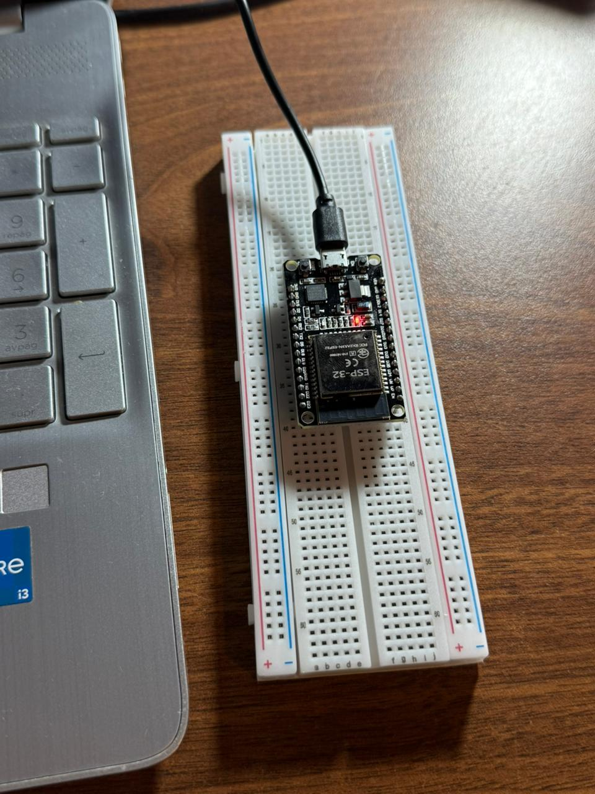

# Config Arduino IDE for ESP32 (CP2102 Chip)

This section covers the technical process of setting up the development environment and ensuring proper communication with the hardware.

## 1. Software Installation
The first step is to obtain the official development environment:
* **Arduino IDE:** Download the latest version from the [official Arduino website](https://www.arduino.cc/en/software/).

## 2. Environment Configuration
To enable the IDE to compile code for the ESP32, the Espressif board support must be added:

1. **Additional Boards Manager URLs**: 
   * Open the IDE and navigate to `File > Preferences`.
   * In the **Additional Boards Manager URLs** field, enter the following JSON link:
     `https://espressif.github.io/arduino-esp32/package_esp32_index.json`
2. **Core Installation**:
   * Go to `Tools > Board > Boards Manager`.
   * Search for and install the package **esp32 by Espressif Systems**.

## 3. Driver Installation (CP2102 Chip)
If the USB port is not recognized when connecting the board, you must install the USB-to-Serial bridge drivers:
* **Silicon Labs CP2102 Driver**: [Download here](https://www.silabs.com/software-and-tools/usb-to-uart-bridge-vcp-drivers)
* **Installation Tip**: On Windows, after downloading and extracting the `.zip` file, right-click the file named `silabser.inf` and select **Install**.

## 4. Connection Verification and First Upload
To confirm the configuration is successful, perform a test upload:
1. Connect the ESP32 to your computer.

2. Select the board model in `Tools > Board > esp32` (commonly **ESP32 Dev Module**).
3. Select the active COM port in `Tools > Port`.
4. Upload the **Blink** example (`File > Examples > 01.Basics > Blink`).

---

## 🛠️ Troubleshooting

During my installation process, I identified the following critical points that may hinder development:

### Error: DEADLINE_EXCEEDED (Library Download Failure)
If the Boards Manager fails due to timeouts or network errors:
* **Solution**: Perform a **manual installation**. Download the source code from the [GitHub Release Repository](https://github.com/espressif/arduino-esp32/releases) and place it in the `hardware/espressif/esp32` folder within your Arduino sketchbook location. Run the `get.exe` (or `get.py`) found in the `tools` folder.

### COM Port Does Not Appear (Port Grayed Out)
Even with drivers installed, the board may not be detected by the system.
* **Identified Cause**: Using "Charge-only" USB cables.
* **Solution**: Replace with a **Micro-USB Data Cable**. It is vital to ensure the cable has internal data wires; otherwise, serial communication cannot be established.

---
*This document is part of my progress toward the International Engineering Certification.*
